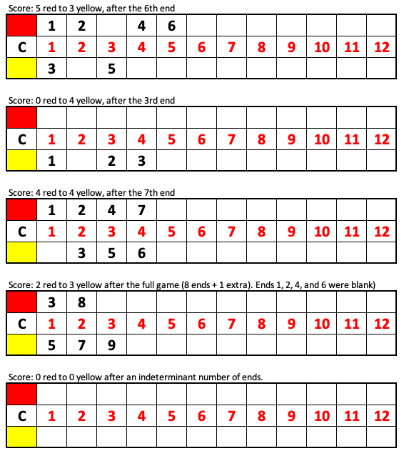
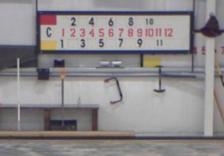
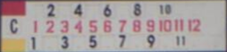
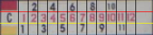

# Curling Scoreboard Reader

The goal of this software is to read a curling scoreboard. It will receive an image containing the scoreboard and attempt to read the score for each end.

## Basics of scoring in curling

1. A single curling game consists of either 8 or 10 "ends" (think "innings" from baseball). In the event of a tie after all ends, there is the possibility that one additional end is played.
2. After each end, one of the following happens:
   - The red team scores between 1 and 8 points, inclusive.
   - The yellow team scores between 1 and 8 points, inclusive.
   - Neither team scores, and it is considered a "blank" end.
3. Once the scoring team and number of points is determined, a player hangs on the scoreboard a card that represents the end that was just completed.
   - The card is hung on the row that represents the scoring team: red on the top row, yellow on the bottom row.
   - The card is hung directly above or below the number from the middle row that represents the total number of points for that team up through that end.

### Valid and invalid assumptions

Based on the above, we can make the following assumptions:

1. Each row of numbers will always be in ascending order.
2. The distance between two black cards on the same row will never be greater than 8.

And these are **invalid** assumptions:

1. Every black number will appear on the scoreboard (there is the possibility of blank ends).
2. Every red number will have a black card above or below it.
3. A red number will not have a black card both above and below it (the score may be tied).
4. Each row has at least one black card (if the team has not scored yet, they will not have any black cards).

### Additional knowledge

- Scores of 1, 2, and 3 points are very common. Increasing from there they become more rare. Scores of 7 happen a few times a year, and scores of 8 happen once every few years.
- It is possible to score more than 12 points in a game, but it's uncommon, and the scoreboards don't support these high scores.

### Sample scoreboards



## CV Solution

Here is an outline of tasks implemented by this software.

### Connect to RTSP camera feeds with the ability to capture still images

This will end up being the source material for CV scoreboard reading. There will be up to 4 cameras capturing 4 different scoreboards simultaneously. For each image captured by one of the cameras, it must flow through the remaining tasks.

Example of a still image captured by the the camera (note: this is a contrived example):



Also have a look at [Scoreboard B](./meta/scoreboard-b.png). I may be able to adjust the focus on the camera to improve the image quality of the Scoreboard C camera.

For a few hundred real scoreboard examples, see [Sample scoreboard images](https://drive.google.com/open?id=1OwWMjiAvWT7gaOG3-WHLXb3u8bc8al1l) in Google Drive.

### Identify and crop the scoreboard

Using the scoreboard templates ([tl](templates/scoreboard-tl.jpg), [tr](templates/scoreboard-tr.jpg), [bl](templates/scoreboard-bl.jpg), [br](templates/scoreboard-br.jpg)), find the four corners of the scoreboard. Then apply a [four-point transform](https://www.pyimagesearch.com/2014/08/25/4-point-opencv-getperspective-transform-example/) to normalize the rectangle of the scoreboard and crop it.

If the scoreboard can't be identified, ignore the image and wait for a new one to process.

Example of a cropped and transformed scoreboard:



### Identify 24 regions of interest where end cards may be hung

Assuming the scoreboard is divided into even regions, it is easy to identify the 12 cells for the red team's end cards and the 12 cells for the yellow team's end cards.

ROI Divisions:



### OCR each ROI

Process each ROI with optical character recognition (OCR) to determine: a) whether or not an end card is hung in the space, and b) the number displayed on the card, if it exists. Use the Valid Assumptions listed above if necessary to improve recognition accuracy.

There is also the possibility that the card is occluded by a subject in the camera image. In this case, unknown should be reported.

### Build a data structure to represent the scoreboard

Once all 24 ROIs are processed, return two Lists representing the values in each of the cells.

```
{
    "red": <List of strings>,
    "yellow": <List of strings>
}
```

Where the values in each `<List of strings>` can be:

- `"BLANK"` - indicates there is no card in the cell
- `"1"` - `"11"` - the value of the end card that is hung
- `"UNKNOWN"` - unable to determine the value (e.g. it is occluded)

### Record changes to a database

Compare the above-described data structure and compare it with the previously-recorded value. If it has changed, record the changes in a database with a timestamp.

## Installation and running

Requires Python 3.7 and `opencv-python`. Run `pip3 install opencv-python` to install OpenCV. To run, just execute `python3 app.py`. Edit variables under `# Paths` to change the image that is processed.
